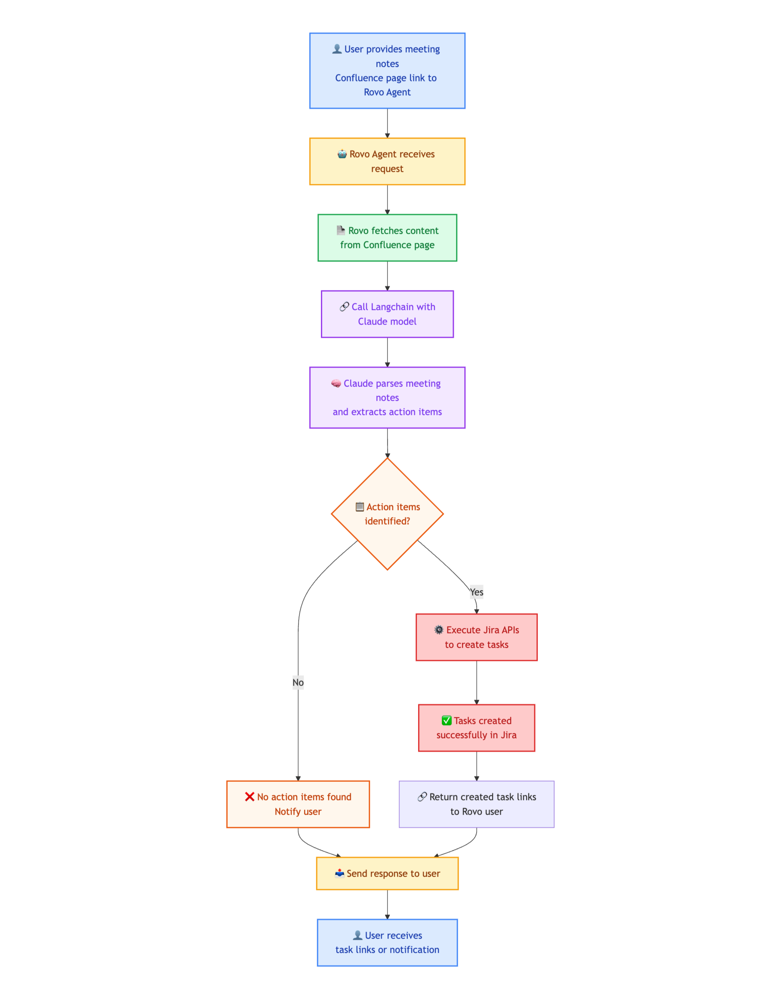

# Development document

* create app in the site with development environment
* make changes and deploy if having small version update. else, run `forge install --upgrade` to install the new version
* create tunnel to test the running app

## Commands to deploy and install this Rovo app

* create new development environment to avoid conflict
```sh
forge environments create # then enter the name of the env -> Enter
```

* Set environment variables:  
    - ANTHROPIC_API_KEY: The Claude API key.
    - JIRA_PROJECT_ID: The Jira project ID, if not set, the default project will be used.
    - JIRA_ISSUE_TYPE_ID: The issue type ID, if not set, the default issue type will be used.
```sh
forge variables set --environment <env-name> --encrypt <key-name> <key-value>
Example: forge variables set JIRA_PROJECT_ID 10010 -e dev_phong
```

* deploy and install the app on the target site
```sh
forge deploy --environment <env-name> --verbose
forge install --site <site-name>.atlassian.net --product <product-name> --non-interactive -e <env-name>
```

* during development phase
```sh
forge deploy -e <env-name>  # deploy changes to the site
Example: 
- forge deploy -e dev_phong
- forge install --upgrade -p Jira -s agileops-ace.atlassian.net -e dev_phong      
- forge install --upgrade -p Confluence -s agileops-ace.atlassian.net -e dev_phong
```

or 
```sh
forge tunnel --debug --debugFunctionHandlers index.<function> --debugStartingPort <port> -e <env-name> # hotload changes
Examplee:  forge tunnel --debug --debugFunctionHandlers index.createFollowUpIssues --debugStartingPort 6868 -e dev_phong
```

* if manifest.yml is updated, you have to run `forge deploy` to apply changes before `forge tunnel`
* if there's major version update, run `forge install --upgrade` instead.

## Flow Diagram
